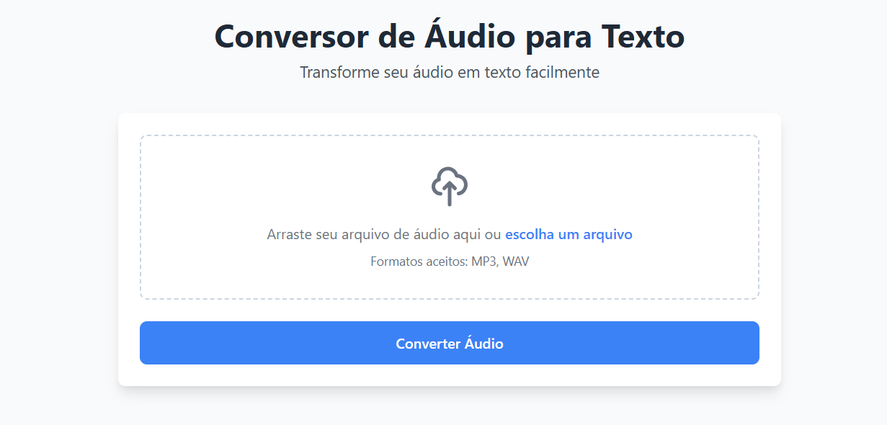

# 🎙️ Conversor de Áudio para Texto

Uma aplicação web moderna e intuitiva que converte arquivos de áudio (MP3 ou WAV) em texto. Desenvolvida com Flask e tecnologias de reconhecimento de voz de última geração.



## ✨ Funcionalidades

- 📁 **Upload Intuitivo**: Interface drag-and-drop para arquivos MP3 e WAV
- 🔄 **Conversão Automática**: Transcrição precisa usando Google Speech Recognition
- 🎵 **Player de Áudio Integrado**: Reproduza o áudio original diretamente na interface
- 📋 **Copiar com Um Clique**: Botão para copiar o texto transcrito
- 💾 **Armazenamento Otimizado**: Conversão automática para WAV quando necessário

## 🔧 Pré-requisitos

- Python 3.8 ou superior
- FFmpeg instalado no sistema (necessário para processamento de áudio)
- Conexão com internet (para o serviço de reconhecimento de voz)

### Sistema Operacional
- ✅ Windows 10/11
- ✅ macOS 10.15+
- ✅ Ubuntu 20.04+

## 🚀 Instalação

1. **Clone o repositório**
   ```bash
   git clone https://github.com/eduardagatti/conversor-audio-texto
   cd audio-para-texto
   ```

2. **Configure o ambiente virtual**
   ```bash
   python -m venv venv
   
   # Windows
   .\venv\Scripts\activate
   
   # Linux/macOS
   source venv/bin/activate
   ```

3. **Instale as dependências**
   ```bash
   pip install -r requirements.txt
   ```

4. **Configure as variáveis de ambiente**
   ```bash
   # Crie um arquivo .env na raiz do projeto
   cp .env.example .env
   
   # Edite o arquivo .env com suas configurações
   ```

5. **Inicie a aplicação**
   ```bash
   # Desenvolvimento
   python app.py
   
   # Produção
   gunicorn -w 4 app:app
   ```

## 🛠️ Dependências Principais

- **Flask** (3.0.2): Framework web
- **pydub** (0.25.1): Processamento de áudio
- **SpeechRecognition** (3.10.1): Reconhecimento de voz
- **python-dotenv** (1.0.1): Gerenciamento de variáveis de ambiente
- **gunicorn** (21.2.0): Servidor WSGI para produção

## 📝 Configuração do FFmpeg

### Windows
1. Baixe o FFmpeg do site oficial
2. Adicione ao PATH do sistema
3. Verifique a instalação: `ffmpeg -version`

### Linux
```bash
sudo apt update
sudo apt install ffmpeg
```

### macOS
```bash
brew install ffmpeg
```

## 🔍 Troubleshooting

### Problemas Comuns

1. **Erro: "FFmpeg not found"**
   - Verifique se o FFmpeg está instalado corretamente
   - Confirme se está no PATH do sistema

2. **Erro: "Could not connect to recognition service"**
   - Verifique sua conexão com a internet
   - Confirme se as credenciais da API estão corretas

3. **Erro: "File too large"**
   - Ajuste `MAX_CONTENT_LENGTH` no arquivo de configuração
   - Considere comprimir o arquivo de áudio

## 🔒 Segurança

- Implementa validação de tipos de arquivo
- Limita tamanho máximo de upload
- Sanitiza nomes de arquivo
- Usa diretório temporário para processamento
- Implementa rate limiting básico

## 📈 Performance

- Processa arquivos de forma assíncrona
- Utiliza cache para resultados recentes
- Otimiza arquivos de áudio antes da transcrição
- Suporta múltiplas requisições simultâneas

## 🤝 Contribuindo

1. Faça um Fork do projeto
2. Crie sua Feature Branch (`git checkout -b feature/AmazingFeature`)
3. Commit suas mudanças (`git commit -m 'Add some AmazingFeature'`)
4. Push para a Branch (`git push origin feature/AmazingFeature`)
5. Abra um Pull Request

## 📄 Licença

Este projeto está sob a licença MIT. Veja o arquivo [LICENSE](LICENSE) para mais detalhes.

## 📬 Contato

Eduarda Gatti - [meduarda.gatti@gmail.com](mailto:meduarda.gatti@gmail.com)

Link do Projeto: [https://github.com/eduardagatti/conversor-audio-texto](https://github.com/eduardagatti/conversor-audio-texto)

---
⭐️ Se este projeto te ajudou, considere dar uma estrela!